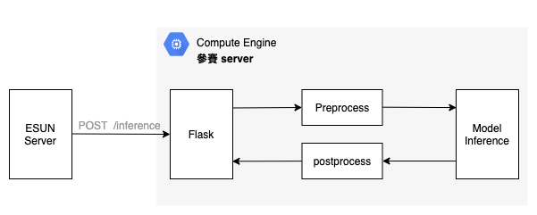

# 【看見你的聲音 - 語音辨識後修正】 api server 架構分享

## 設計理念

越基本越快上手，Flask 是個能夠快速上手且能夠快速在任何有 python 環境的機器上快速執行 web service 的套件。
我們直接透過範例程式啟 flask 來當作 web service，再接上基本資料前處理讓我們的 model 能夠快速的產生出可能的語句，並且快速回傳給 client 端。

## 1. 系統設計假設
- 至少要能同時處理 10 個 api requests(換句話說，可能同時被10個人扁，痛覺同時被大腦接收)
- 在 1 秒鐘內完成文字修正 inference
- 快速 load model 

## 2. 計算所需資源
因考量本次比賽真正會用到的天數僅有10天，決定使用開一台VM，將model, log都放在local端，比賽結束後取出即可。

**機器規格**  
|          key           |         value                         |
| ---------------------- | -------------------------------- |
| cloud service provider | GCP                              |
| machine type           | n1-standard-1 (1vpc, RAM:3.75GB) |
| zone                   | us-central1                      |
| OS                     |Debian GNU/Linux 10 (buster)|

**系統架構圖** 



**元件簡介** 
1. Flask: api server，每秒可以接收10個request，將主辦單位發來的request做資料前處理
2. Preprocess: 將 request 中的兩個 list 進行處理
3. Model Inference: 將預先處理好的 data 送進 model 中進行運算，再依回傳規格給主辦單位 Server
4. Postprocess: 因應api spec要求，檢查輸出資料格式並加上key值

## 3. 額外補充
**快速inference技巧**
1. api server 啟動時就預先載入 model

**程式架構維運技巧**
1. 寫log: 方便後續比賽結束後追蹤api回應狀況
2. 使用 ArgumentParser: 彈性指定輸入的參數

## 4. 快速上手
```sh=
# 設定 virtual environment
python3 -m venv venv
source venv/bin/activate

# 安裝必要套件
pip3 install -r requirements.txt

# 執行 flask程式
python3 api.py

# 關閉 virtual environment
deactivate
```
